Twitter Tweets to ServiceNow Incidents:

This flow identifies hashtags addressed to a certain twitter account and directs tweets with certain hashtag to ServiceNow, to create incidents and other tweets to GoogleSheet to log for future reference. 

1) Start with an empty flow:

 

2) Double Click on the ‘Start’ icon to see the list of triggers. Search for Twitter.

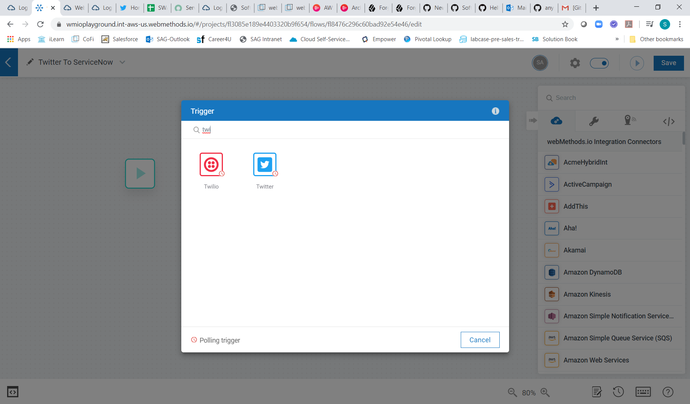 
 
3) Create a new trigger definition. Trigger the flow when there is a tweet mentioning you with the list of hashtags in the hashtag field.

 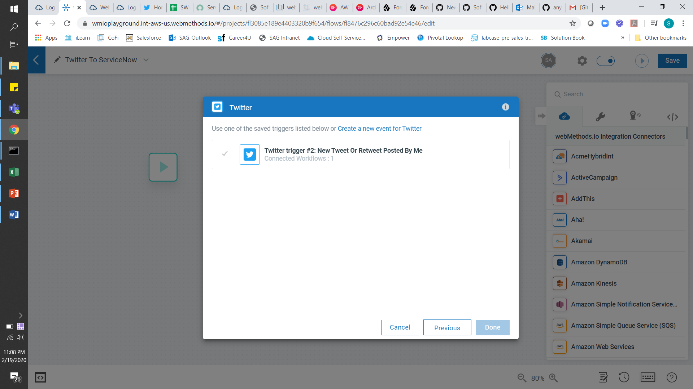 
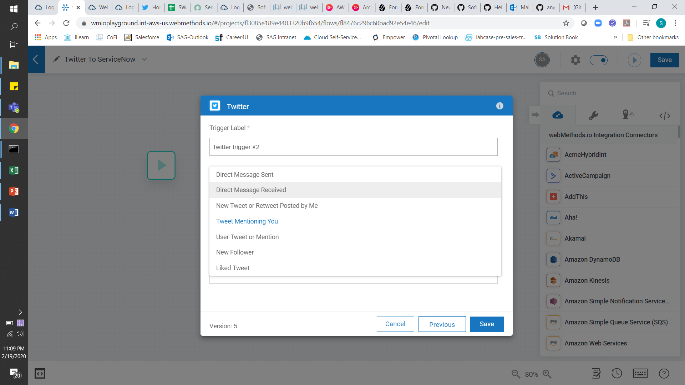 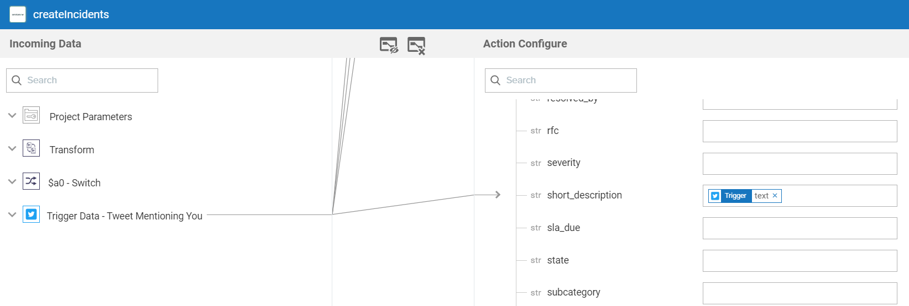 
 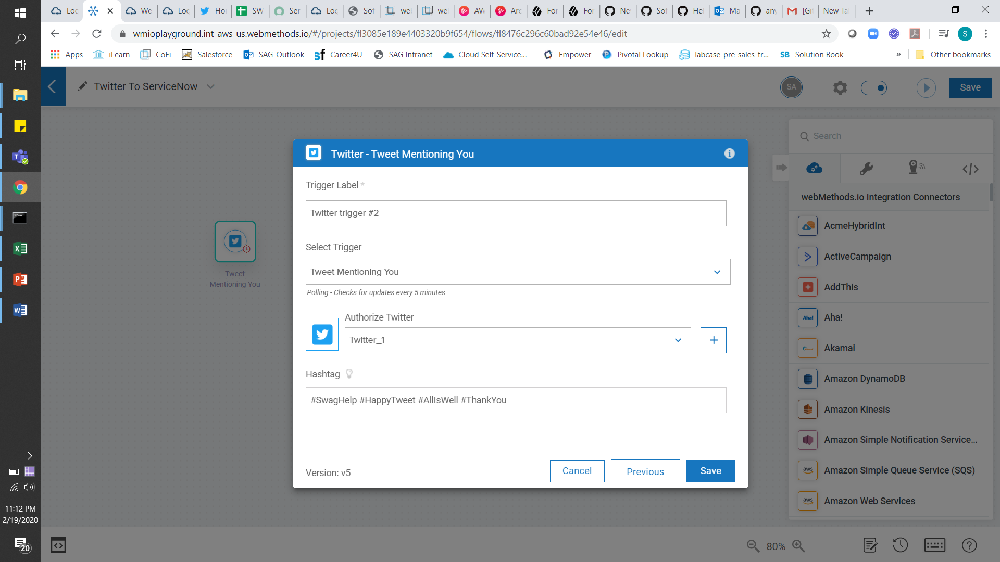 
 

3) Add a switch and a Service Now step to the flow.

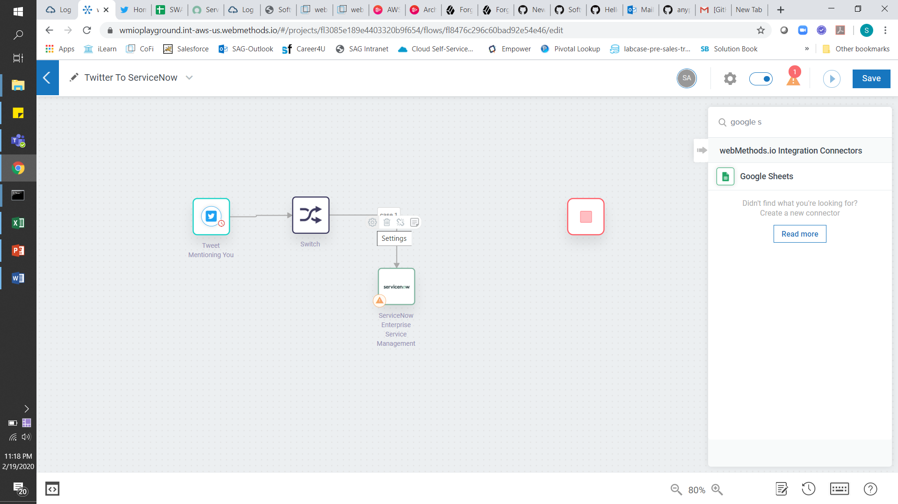 
 
4) Configure ServiceNow with your ServiceNow Developer Account Details. Select the createIncidents operation.
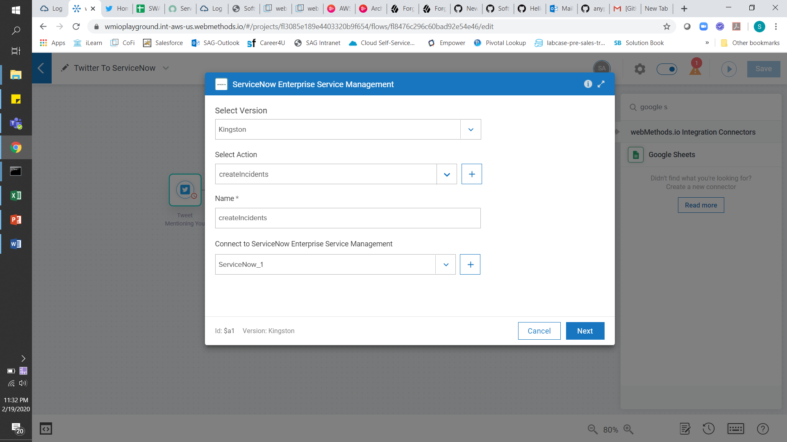  

5) Configure ServiceNow CreateIncidents mapping 

  
 
 
5) Click on the path from Switch to ServiceNow and add the Case1 Definition. In this case, we want to filter the Hashtag array received from Twitter feed and identify if the array has #SwagHelp. If yes, send that feed to serviceNow to create a new Incident. 

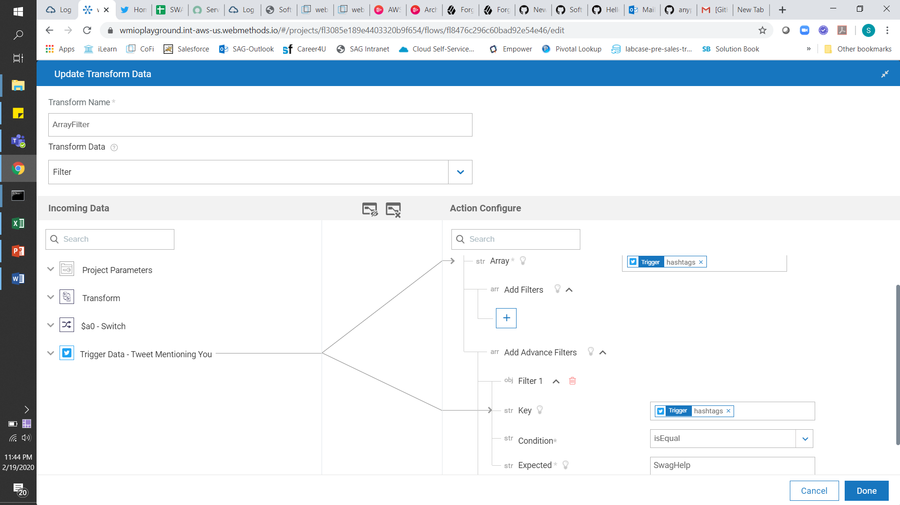 

Click on Transform > Add Transform Name > Select Transform Data as Filter (from the Array subsection). 

Drag and drop the ‘Hashtags’ array from Twitter Trigger output (left side) to the Array field on the right side. Use AdvancedFilter to filter the Array object where hashtag[] = ‘SwagHelp’. Click Done on the transform window.

 

6) On the condition window, the newly created transform variable is available to use. Map the filtered array to filter 1 on right side and check if this array has any elements. If it does, it means we received a #SwagHelp in the feed.  
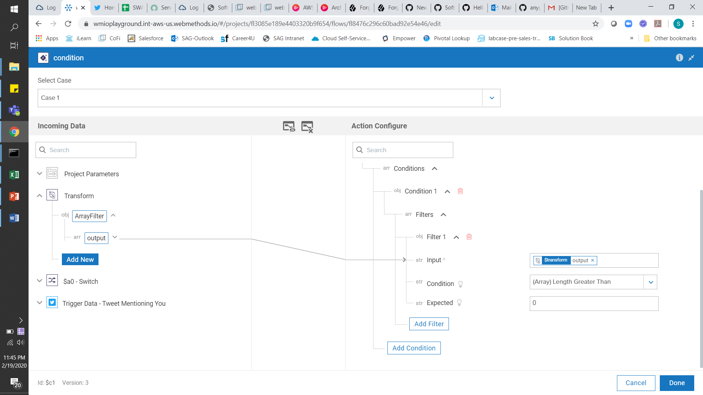 

7) For the Default flow of switch case, map that branch to a Google Sheet workflow step. All other hashtags will cause the twitter feed to be logged into an excel/Google Sheet. This can be later converted into a CSV or JSON for further processing and analysis, if required. 

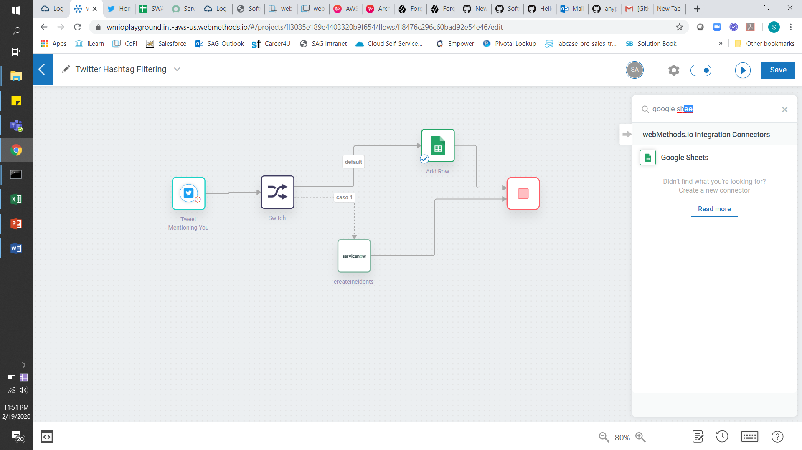 

 

8) GoogleSheet add row configuration
 
 

9) The spreadsheet id and sheet name show as dropdowns and you can pick from the available spreadsheets in your google drive. 

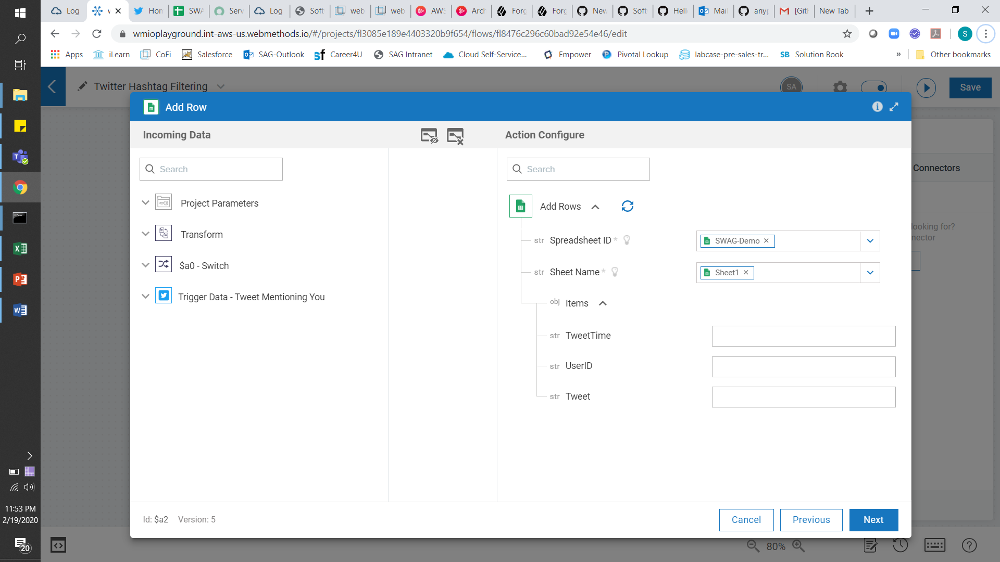  

Using Transform capability to get the current datetime in a specific format.
 
  

Mapping the userid, tweet and currentDateTime (from Transform section). 
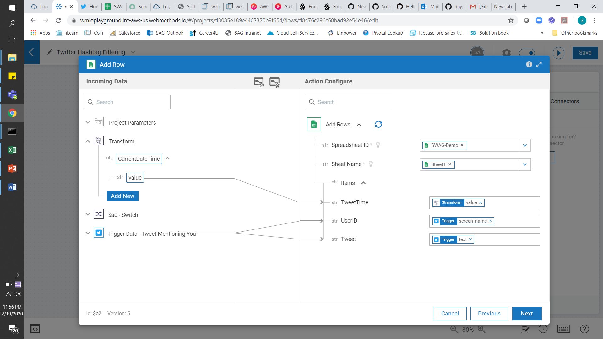 

Output:

Twitter Tweet:

 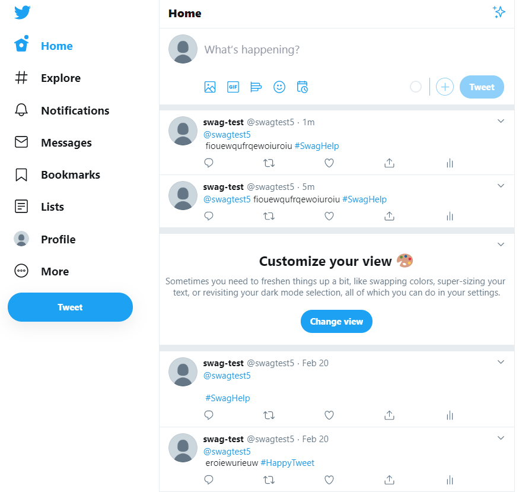 
 
webMethods.io:

 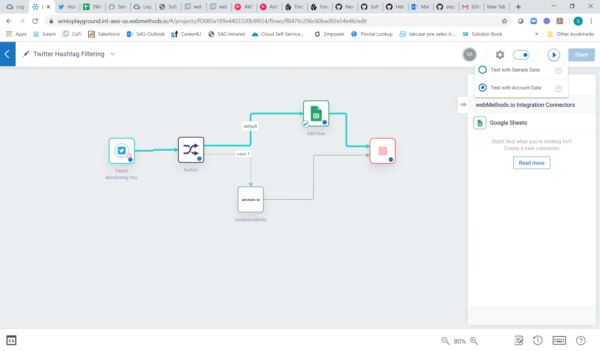 

Service Now:

 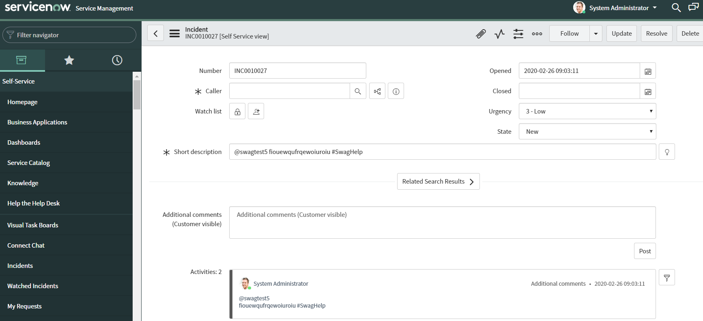 

Google Sheet:
When the tweet doesn’t contain the #SwagHelp tag:

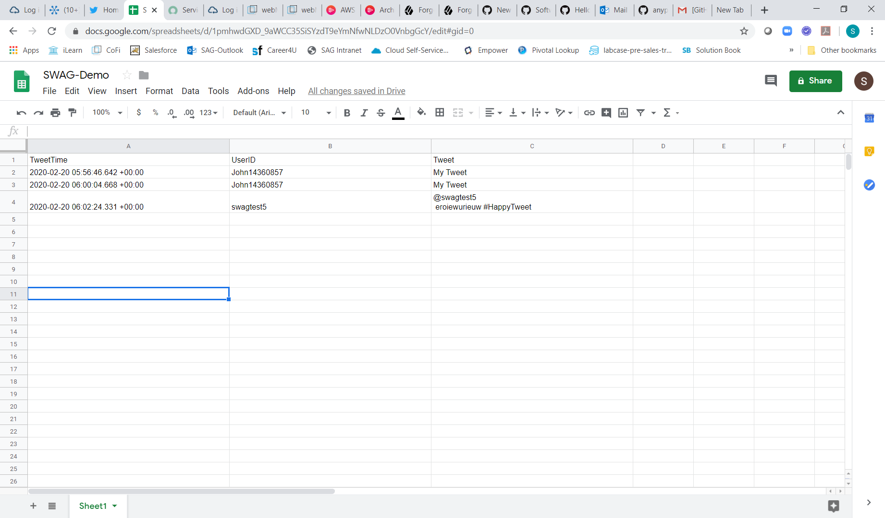 
