# Multiple Insert in MySQL

This workflow example shows how data formatted as CSV String (which is Base64 encoded) will be inserted into a MySQL database. To achieve this, it will be first decoded, then converted into JSON, and finally inserted into the DB inside a loop.
One important detail is that the rows will not be inserted one by one into the DB, but they will be inserted in groups. For this, the initial array will be chunked into smaller arrays, transformed (using a custom NodeJS connector) and finally inserted into the database using the OOTB MySQL connector.

## Import Recipe
To import the provided example as recipe into your system, follow the steps:

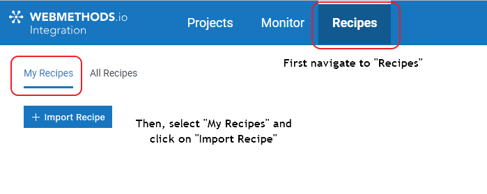

In the opening popup, select the provided "MySQL-ChunkAndInsert.zip" and click on "Open". After this, you should be able to see the recipe like:

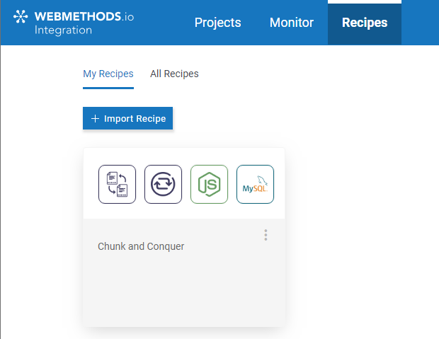

## Create a custom NodeJS connector
One of the steps in the workflow is done using a custom NodeJS connector. To create it in your environment, open a workflow, expand the connectors palette and select the "Custom" connectors. After that, click on the "+" icon to create it.

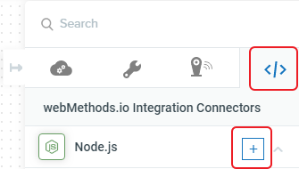

In the opening window, paste the content of the provided file "[Prepare Multiple Insert MySQL](./custom_nodejs/prepare-multiple-insert-mysql.js)". Here's an snippet of what it does.

```javascript
var request = require("request");

module.exports = function () {
    this.id = "prepare-multi-insert-mysql";
    ...
    this.input = {
        ...
    };

    this.output = {
        ...
    };

    this.execute = function (input, output) {
        if (input.inputArray && Array.isArray(input.inputArray) && input.inColumns) {
            const varst = input.inColumns.split(",");
            if (varst && varst.length > 0) {
                var r4m = input.inputArray.map(function (item, idx) {
                    var row = "("
                    for (let i = 0; i < varst.length; i++) {
                        const key = varst[i].trim();
                        row += "'" + item[key] + "',";
                    }
                    // replace the ',' at the end for a ')'
                    row = row.replace(/,$/, ")");
                    return row;
                })
                output(null, {
                    insertValues: r4m.toString(),
                    insertKeys: "(" + varst.toString() + ")"
                });
            }
        }
    }
}

```
Once you have created it, you will be able to use it in other workflows as well.

## Create workflow from recipe

After you have imported your recipe and created the custom NodeJS connector, you can create a new workflow based on the recipe. Once you have done it, you will need to configure a connection to a MySQL database and, additionally, the webhook payload details as below:

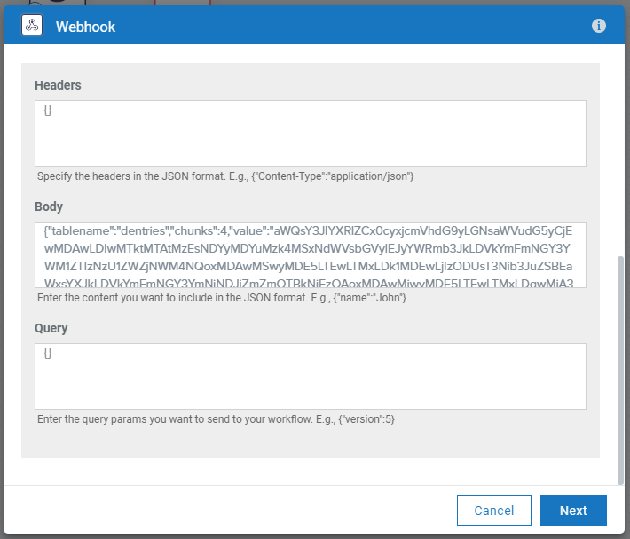

## Workflow overview
The workflow looks like:

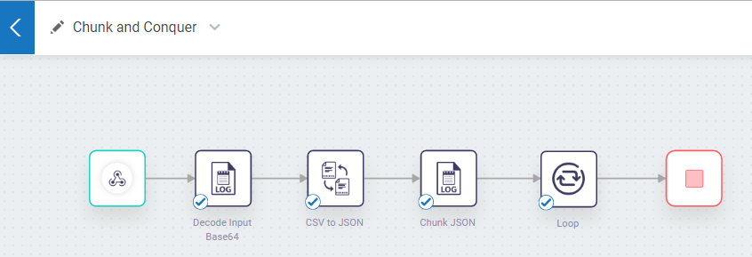

The different logger steps contain as well some transformations inside them.

### Decode Input Base64

This step is only a container for some of the needed transformations. When you expand the _"Transform"_ node on the left side of the image, you will be able to see the list of transformations that have been created in this node and the previous ones. You can only edit the transformations created in the current node, which you will recognize by the "edit/delete" icons that appear when you hover with the mouse over the name of the transformation.

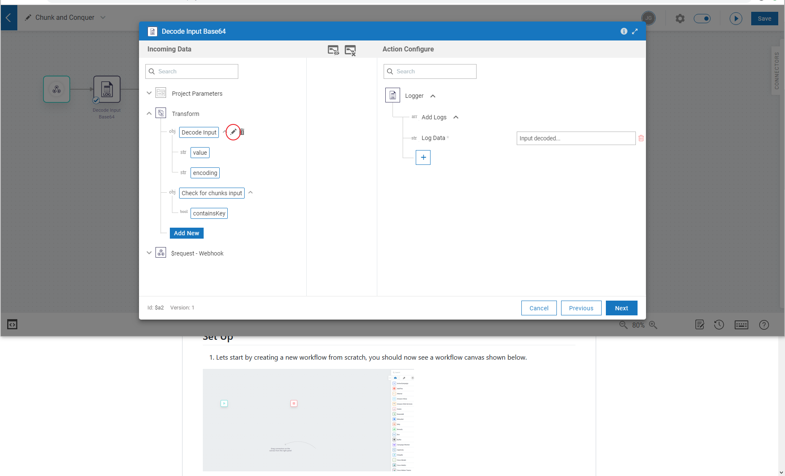

Once you click on the edit icon, you can see and update its details.

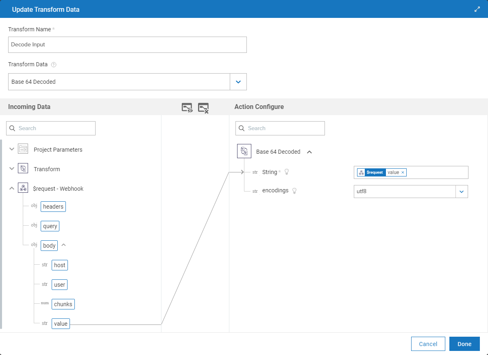

### CSV to JSON

Once the CSV input string has been decoded, it can be transformed into JSON for further processing.

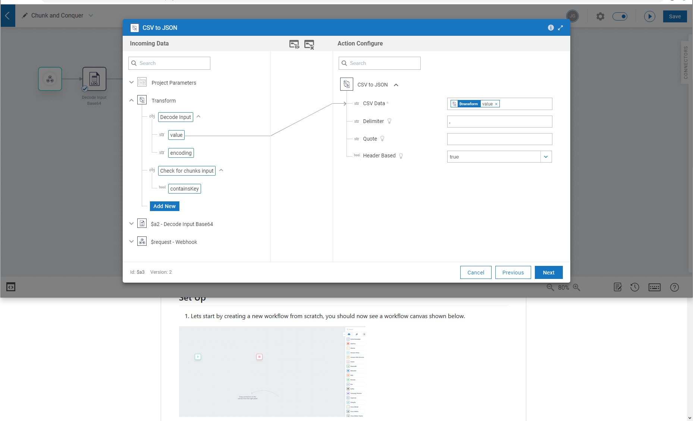

### Chunk JSON

The transformation to chunk the original JSON array into smaller ones is done inside a Log element. Same as before, once you expand the _"Transform"_ node, you can go into the details of the _"Chunk to Process"_ transformation.

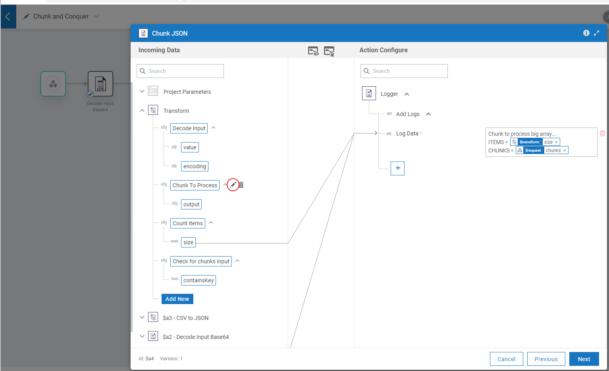

The details of the chunk transformation can be seen below.

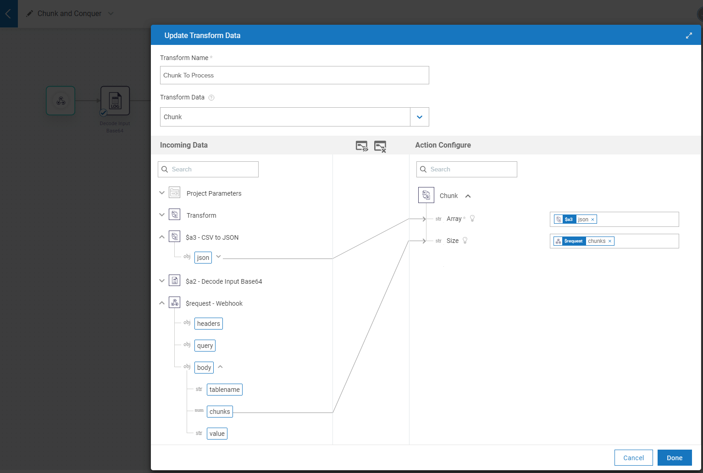

### Loop

Now, instead of looping and inserting each single record from the input array, we'll loop through the created chunks.

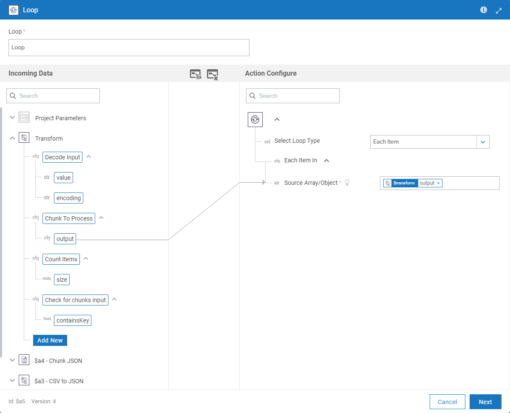

Inside of the loop there are only two steps.

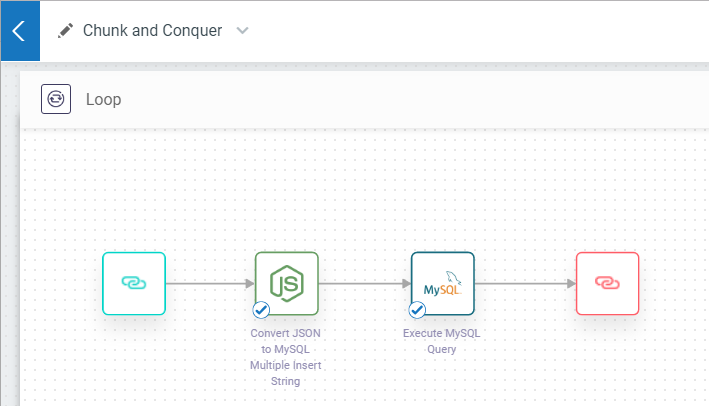

#### Prepare input for insert statement

The first step transforms the incoming JSON into the format needed by MySQL. The insert statement will look something like:

```
-- Adding multiple records with single INSERT command
INSERT INTO TABLE
   (field1_name, field2_name, ...)
VALUES 
   (value11, value12, ...), -- row 1
   (value21, value22, ...), -- row 2
    ...
   (valueN1, valueN2, ...); -- row N
```

This step prepares both the comma-separated list of all its fields inside parentheses, like:
`(id,created,ts,creator,clientnr)`

as well as the list of comma delimited values to be inserted in parentheses, like:

`('10000','2019-10-31','46206.3981','Mueller Bradford','5dbaf4f7ac5e23755efc5c85'),('10001','2019-10-31','95010.2385','Osborne Dillard','5dbaf4f7bcc42cfff90d6138')`

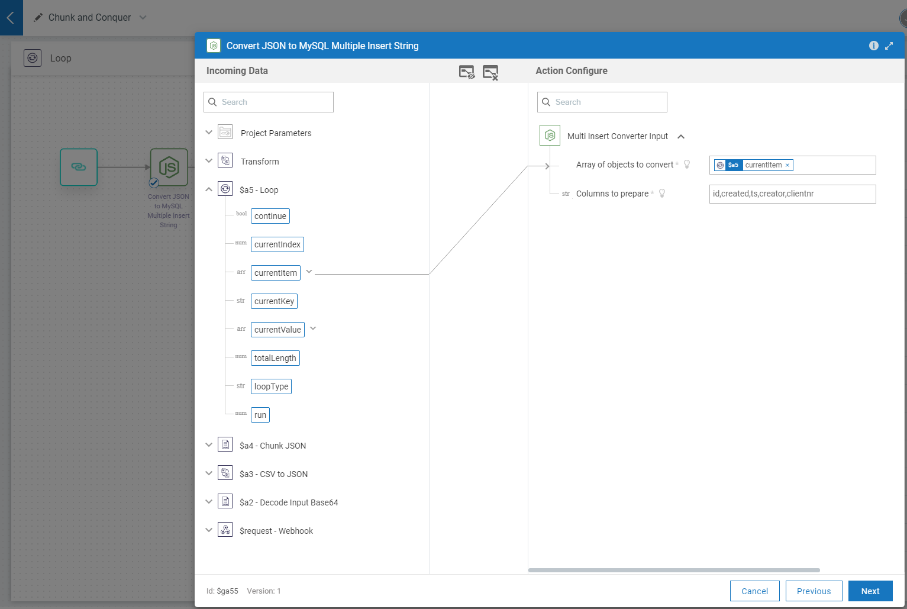

#### MySQL Insert

What we only need to do now is mapping the output from the previous step into the insert statement (as specified before).

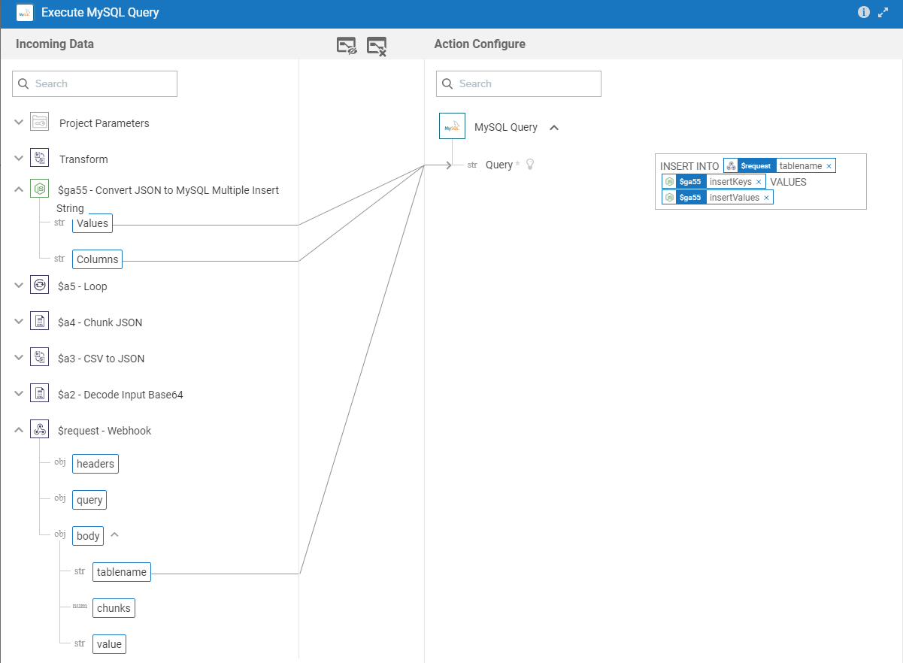

I hope that you find this example helpful and that it makes your experience with [webMethods.io Integration](https://webmethods.io) more comfortable.

***

These tools are provided as-is and without warranty or support. They do not constitute part of the Software AG product suite. Users are free to use, fork and modify them, subject to the license agreement. While Software AG welcomes contributions, we cannot guarantee to include every contribution in the master project.

Contact us at [TECHcommunity](mailto:technologycommunity@softwareag.com?subject=Github/SoftwareAG) if you have any questions.