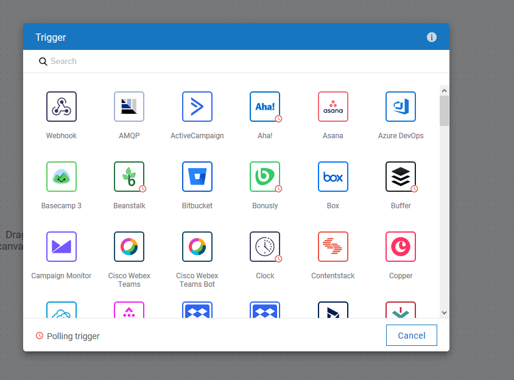
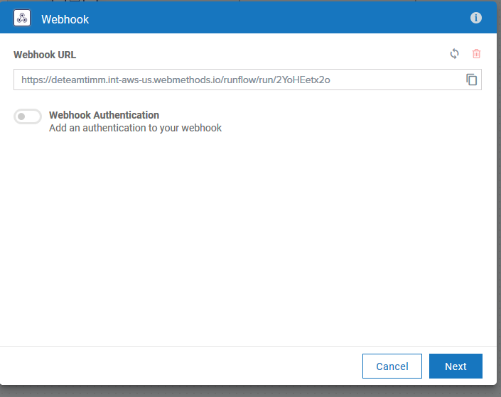
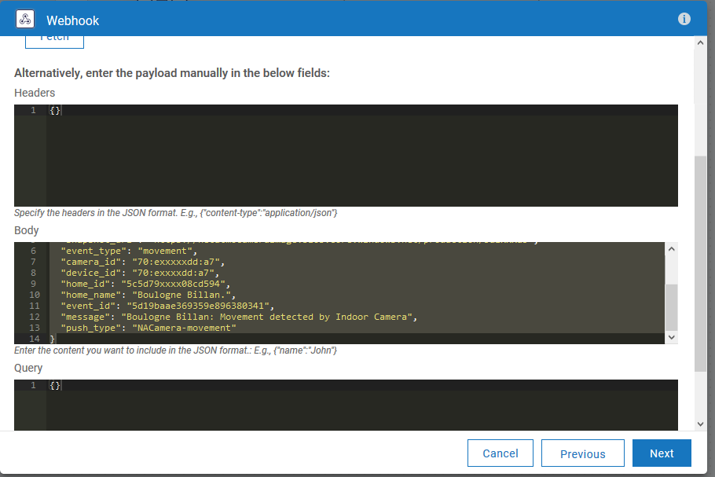
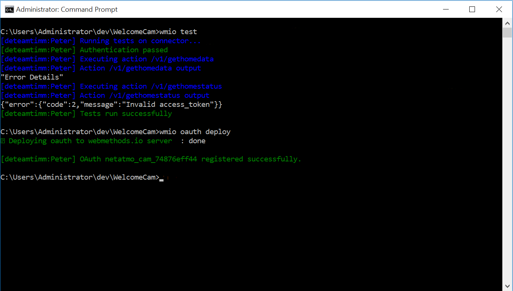
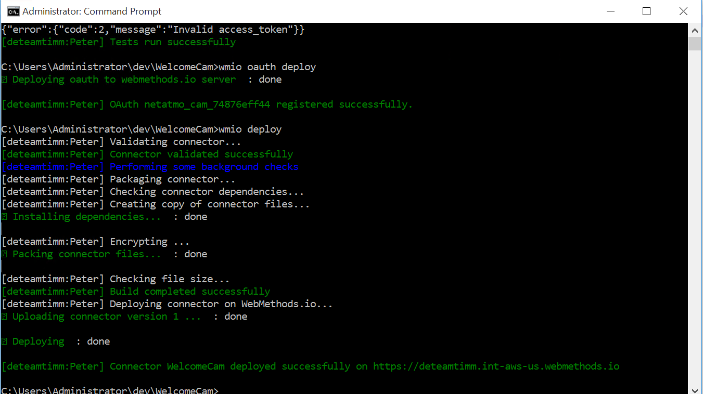
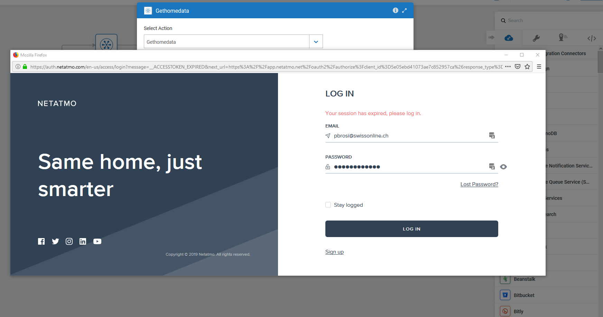
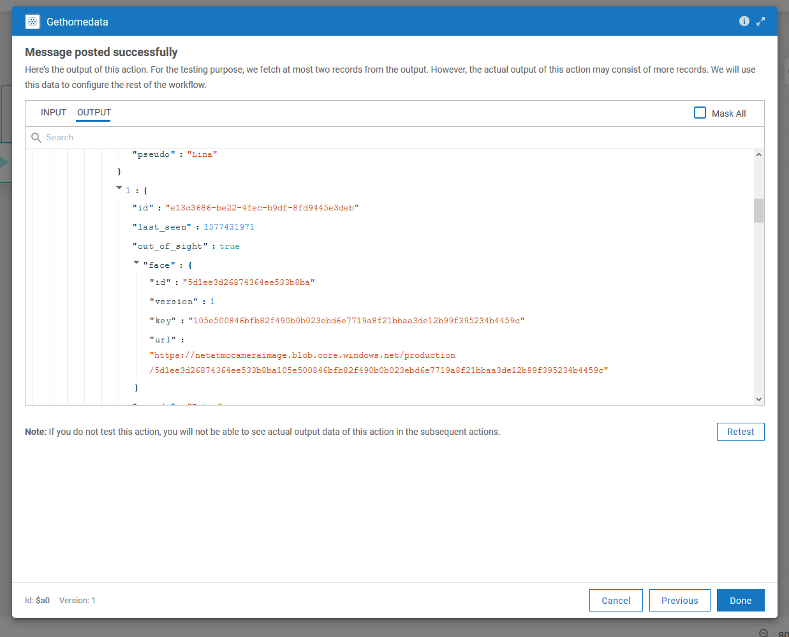

# Custom connector for Netatmo Security Camera

This is a simple home automation example based on a Netatmo security camera (custom connector) as well as an integration to Philips Hue Lighting system. 

A simple workflow is triggered by the security camera detecting a person, and if the person is recognized, the Hue lights are controlled based on the individual's profile. 

The custom connector is based on the Netatmo camera (https://www.netatmo.com) and controlled by an app available on https://dev.netatmo.com. 

## Prerequisites

To set up this example you need the following hardware devices: 
- Netatmo Security Camera:  https://www.netatmo.com/en-us/security/cam-indoor
- PHilips Hue Bridge and attached lighting: https://www2.meethue.com/en-us/starter-kits

The corresponding user accounts need to be created in the respective web applications: 
- Netatmo :  [https://dev.netatmo.com] (dev.netatmo.com)
- Philips Hue:  [https://account.meethue.com/account] (www.meethue.com)

Additionally, you need valid credentials for webMethods.io Integration - [https://www.softwareag.cloud/site/product/webmethods-io-integration.html#/](https://www.softwareag.cloud/site/product/webmethods-io-integration.html#/). 

## Create a custom connector for Netatmo security

Follow the instructions on [https://docs.webmethods.io/integration/developer_guide/connector_builder/#gsc.tab=0](https://docs.webmethods.io/integration/developer_guide/connector_builder/#gsc.tab=0) to set up the connector framework by first installing the correct node.js version and then testing it. 

To deploy the custom connector example in the directory you need to first create an app and customize the oauth.json.template file with the correct credentials. 

### Create a new workflow with a Webhook triggered

We need to first create a new workflow, triggered by a Webhook, so that we can tell Netatmo where to send event notifications. 
This workflow will get invoked by the Netatmo security camera on all relevant events, e.g. movement detection, person detection events and others. 

Copy the Webhook link created into the clipboard using the symbol at the right of the URL. 

To test the Webhook trigger, you can enter the following test data into the body of the next page: 

{
  "user_id": "5c810xxxxxxx45f4",
  "snapshot_id": "5d19bxxxxxx6380342",
  "snapshot_key": "f0134210ff83fxxxxxxxf770090a423d9a5",
  "snapshot_url": "https://netatmocameraimage.blob.core.windows.net/production/5d1xxxa5",
  "event_type": "movement",
  "camera_id": "70:exxxxxdd:a7",
  "device_id": "70:exxxxdd:a7",
  "home_id": "5c5d79xxxx08cd594",
  "home_name": "Boulogne Billan.",
  "event_id": "5d19baae369359e896380341",
  "message": "Boulogne Billan: Movement detected by Indoor Camera",
  "push_type": "NACamera-movement"
}

Connect the Trigger step to the end step and save the workflow for the moment. 

### Create a Netatmo app 

Log in to the Netatmo developer homepage at [https://dev.netatmo.com](https://dev.netatmo.com) and navigate to the myApps area.
Create a new app by providing name, description and email-id as required. 

Scrolling down to the section "App Technical Parameters", fill in the webhook URL that you have copied from your workflow trigger. 

Take a note of the client ID and client secret keys listed here. You will need these to configure the oauth file before deployment of the custom connector. 
Leave the redirect URL empty for now, we will come back to fill it out later. 

### Customize the oauth Authentication 

Edit the file oauth.json in the custom connector directory ./NetatmoSecurity. 

Fill in the client ID and secret that you have copied from the Netatmo app area replacing the text in the fields marked with <> brackets. 
Save the oauth.json file and test the consistency of the custom connector by running: 

**_wmio test_**

from the NetatmoSecurity directory.
Deploy the oauth custom authentication module by running: 

**_wmio oauth deploy_**

### Deploy the custom connector

Finish by deploying the custom connector to your webMethods.io instance. 

**_wmio deploy_**

### Finish the Netatmo app configuration

As a last step, we need to configure the callback URL in the netatmo app for the oauth credential process. 
For this, you need to copy the URL at the end of the oauth.json file ("redirectURL") into the appropriate Netatmo app field ("redirect URI") that we had left blank before. 
Don't forget to save the modified Netatmo app. 

## Configure the home automation workflow

### Netatmo custom connector steps

You can now use the custom connector to view security camera information, for example by invoking the Gethomedata function to retrieve camera and other IDs: 

The first time you use the custom connector (called NetatmoSecurity) you will need to configure the credentials as usual by logging into the Netatmo callback link and providing the credentials: 

After that, you can use the connector as usual to retrieve data from the security camera: 

### A small example worflow to demonstrate home automation. 

The following small example can be used to also demonstrate Webhooks triggered by the Security camera and subsequent control of lighting elements, for example to automate lighting based on the person detected. 

## Summary

A custom connector to integrate a Security camera (from Netatmo) has been used to demonstrate custom connector development for home automation purposes. 
A possible application to control home lighting based on events (e.g. motion or person detection) would be a possible application. 
Other possible applications would be triggering of alarms or notifications based on motion events. 

 

